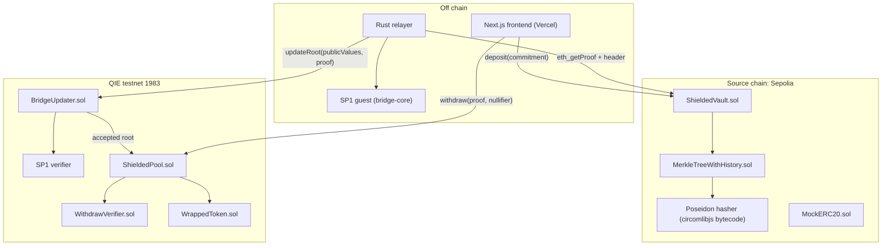

# Architecture

Low level map of every component in the QIE ZK Privacy Bridge: what each file
does, how data flows, and where the trust boundaries sit.

## System overview



## Directory tree

```
veil-bridge/
  contracts-source/      Foundry project, source chain (Sepolia)
  contracts-qie/         Foundry project, QIE testnet
  circuits/              Circom withdraw circuit + Groth16 setup
  sp1-program/           bridge-core lib + SP1 guest
  relayer/               Rust relayer (watcher, prover, submitter)
  client/                TS CLI SDK (note, proof, deposit, claim)
  frontend/              Next.js app, deployed to Vercel
  scripts/               e2e_local, run_local, deploy_testnet, test_testnet_e2e
  docs/                  ARCHITECTURE, TRUST_MODEL, USAGE, FUNDING
  SUMMARY.md             Project orientation + operational rules
```

## scripts

| File | Responsibility |
|------|----------------|
| `e2e_local.sh` | Single local node, full CLI pipeline (ERC20 vault). Fastest end-to-end check. |
| `run_local.sh` | Two anvils (chain ids 11155111 + 1983), deploys all contracts, runs the relayer loop, writes `frontend/.env.local`, starts the dev server so the UI works with a real wallet. |
| `deploy_testnet.sh` | Gas-lean Sepolia + QIE deploy (native vault, tiny denom, legacy gas, hasher reuse, balance precheck), syncs `NEXT_PUBLIC_*` to Vercel, ships production. `SKIP_CONTRACTS=1` redeploys only the frontend. |
| `test_testnet_e2e.sh` | Live deposit -> relayer -> shielded claim assertion using `./.env` addresses. |

## contracts-source (Sepolia)

| File | Responsibility |
|------|----------------|
| `src/IHasher.sol` | Poseidon interface `poseidon(bytes32[2]) returns (bytes32)`. Prod uses circomlibjs bytecode, tests use a keccak mock. |
| `src/MerkleTreeWithHistory.sol` | Depth 20 incremental Poseidon tree over BN254. Caches zero subtrees and filled subtrees for O(levels) inserts. Keeps a 30 entry rolling root history. Mirrors the latest root into the fixed storage slot `latestRoot` (slot 3) so the relayer proves one stable slot. |
| `src/ShieldedVault.sol` | Locks a fixed `denomination`, inserts the caller `commitment` into the tree, emits `Deposit(commitment, leafIndex, timestamp)`. No recipient recorded. Native or ERC20. |
| `src/mocks/MockERC20.sol` | Freely mintable test token. |
| `src/mocks/MockHasher.sol` | Keccak based `IHasher` for Foundry logic tests. |
| `script/DeploySource.s.sol` | Deploys `ShieldedVault` against a pre deployed hasher. `TOKEN_ADDRESS=0x0` selects a native-coin vault (used on testnet to save gas); unset deploys a MockERC20. |
| `test/ShieldedVault.t.sol` | Deposit, multi deposit, duplicate revert, native vault, value checks. |

## contracts-qie (QIE testnet)

| File | Responsibility |
|------|----------------|
| `src/libraries/BridgePublicValues.sol` | ABI schema `(bytes32 blockHash, uint256 blockNumber, address vault, bytes32 root)` shared verbatim with the Rust guest. The single source of truth that prevents Solidity and Rust drift. |
| `src/BridgeUpdater.sol` | The light client. `updateRoot(publicValues, proof)` calls the SP1 verifier, decodes the now trusted public values, checks `vault == sourceVault`, records the root. Owner can rotate the guest vkey. |
| `src/ShieldedPool.sol` | `withdraw(pA, pB, pC, root, nullifierHash, recipient, relayer, fee, refund)`: rejects spent nullifiers, requires an accepted root, verifies the Groth16 proof, marks the nullifier, mints `denomination - fee` to recipient and `fee` to relayer. |
| `src/WrappedToken.sol` | ERC20 mintable and burnable only by the pool. |
| `src/verifiers/IWithdrawVerifier.sol` | Interface for the Groth16 verifier (6 public signals). |
| `src/verifiers/WithdrawVerifier.sol` | snarkjs exported Groth16 verifier (generated by `circuits/scripts/export-verifier.sh`). |
| `src/mocks/MockWithdrawVerifier.sol` | Configurable verifier for pool tests. |
| `script/DeployQie.s.sol` | Deploys verifier, wrapped token, updater, pool, wires the minter. Falls back to `SP1MockVerifier` when no SP1 gateway is provided (native verification). |
| `test/Bridge.t.sol` | updateRoot accept/reject, withdraw mint, relayer fee, double spend, unaccepted root, invalid proof. |
| `test/WithdrawProof.t.sol` | End to end with a REAL Groth16 proof fixture verified on chain plus mint and replay revert. |
| `test/fixtures/withdraw_fixture.json` | Real proof produced by `client/src/genFixture.ts`. |

## circuits

| File | Responsibility |
|------|----------------|
| `commitment.circom` | `commitment = Poseidon(nullifier, secret)`, `nullifierHash = Poseidon(nullifier)`. |
| `merkleTree.circom` | `DualMux` plus `MerkleTreeChecker(levels)` for Poseidon Merkle membership. |
| `withdraw.circom` | Main circuit. Public signals `[root, nullifierHash, recipient, relayer, fee, refund]`, binds the public params so a relayer cannot redirect funds. |
| `scripts/compile.sh` | circom to R1CS plus WASM. |
| `scripts/setup.sh` | Groth16 powers of tau plus a local phase 2 contribution (run a multi-party ceremony for production parameters). |
| `scripts/export-verifier.sh` | Exports `WithdrawVerifier.sol` into contracts-qie. |

## sp1-program

| File | Responsibility |
|------|----------------|
| `bridge-core/src/lib.rs` | `InclusionInput` (header RLP, vault, root slot, account RLP and proof, storage value and proof), `ProvenRoot`, `verify_inclusion` (decode header, verify account MPT proof against state root, verify storage MPT proof against the account storage root, return the root), `abi_encode` matching `BridgePublicValues`. Used by both guest and relayer. |
| `program/src/main.rs` | SP1 guest. Reads `InclusionInput`, runs `verify_inclusion`, commits ABI encoded public values. Built with `cargo prove build`. |

## relayer

| File | Responsibility |
|------|----------------|
| `src/config.rs` | CLI and env config (RPCs, addresses, root slot, key, confirmations, poll interval, store path). |
| `src/contracts.rs` | alloy `sol!` bindings for `ShieldedVault` and `BridgeUpdater`. |
| `src/watcher.rs` | `finalized_block_number` (finalized tag, latest fallback for dev chains), `build_root_job` (builds `InclusionInput` from `eth_getBlockByNumber` plus `eth_getProof`). |
| `src/prover.rs` | `Prover` trait. `NativeProver` runs `verify_inclusion` in-process for local integration testing. `Sp1Prover` (feature `sp1`) produces a Groth16 wrapped proof verified on chain. |
| `src/store.rs` | JSON state of submitted roots so restarts do not re submit. |
| `src/main.rs` | Wires providers, prover, store, runs the relay loop, submits `updateRoot` to QIE. |

## client (CLI SDK)

| File | Responsibility |
|------|----------------|
| `src/poseidon.ts` | circomlibjs Poseidon plus `FIELD_SIZE` and `ZERO_VALUE` matching the contract. |
| `src/note.ts` | Note create, serialize, parse. Format `qie-note-v1:<nullifierHex>:<secretHex>`. |
| `src/merkleTree.ts` | `PoseidonMerkleTree` mirroring the on chain tree to compute Merkle paths. |
| `src/proof.ts` | Witness build, snarkjs `fullProve`, Solidity calldata parse. |
| `src/abi.ts` | Minimal ABIs for vault, pool, ERC20. |
| `src/deployPoseidon.ts` | Deploys the circomlibjs Poseidon hasher. |
| `src/genNote.ts` | No-tx note generator (used by the local end-to-end script). |
| `src/genFixture.ts` | Generates the Foundry real proof fixture. |
| `src/deposit.ts`, `src/claim.ts` | CLI deposit and claim. |

## frontend (Next.js, Vercel)

| Path | Responsibility |
|------|----------------|
| `app/` | App Router pages: landing, deposit, claim. |
| `components/` | UI primitives. `ConnectButton` does multi-wallet EIP-6963 discovery (connect modal + account dropdown); `NetworkGuard` switches/adds the required chain. |
| `lib/` | viem and wagmi config (multi-injected discovery on), chains (Sepolia, QIE 1983), Poseidon, Merkle tree, snarkjs proving in browser, contract ABIs and addresses. |
| `public/circuits/` | `withdraw.wasm` and `withdraw_final.zkey` served to the browser for client side proving. |

## Trust boundaries

1. Relayer cannot forge a vault root: the SP1 proof would fail verification in
   `BridgeUpdater`. Trust reduces to source block header authenticity. See
   [docs/TRUST_MODEL.md](docs/TRUST_MODEL.md).
2. Claimer cannot double spend: `nullifierHash` is recorded on first claim.
3. Privacy: deposit stores only a commitment, claim runs from a fresh wallet and
   reveals only an unlinkable nullifier hash.
