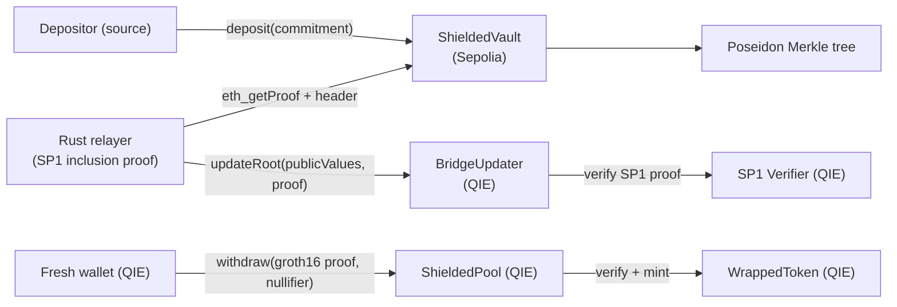

# QIE ZK Privacy Bridge

A trustless, **privacy-preserving** bridge from an EVM chain (Sepolia) into
[QIE](https://docs.qie.digital) (EVM-compatible, testnet chain id `1983`).

It combines three pillars:

1. **On-chain vaults** - lock-and-mint with a Poseidon commitment Merkle tree.
2. **An SP1 zkVM light client** - a Rust relayer proves, against a source block
   header, that a vault root is included in source-chain state. QIE verifies the
   proof; it never trusts the relayer.
3. **A Tornado-style shielded pool** - claims are made from a fresh wallet with a
   Groth16 proof of knowledge of a commitment + a nullifier, severing the link
   between the source depositor and the QIE recipient.



## Repository layout

| Path | What |
|------|------|
| [`contracts-source/`](contracts-source) | Source-chain Foundry project: `ShieldedVault`, `MerkleTreeWithHistory`, `IHasher`. |
| [`contracts-qie/`](contracts-qie) | QIE Foundry project: `BridgeUpdater` (SP1 light client), `ShieldedPool`, `WrappedToken`, exported `WithdrawVerifier`. |
| [`circuits/`](circuits) | Circom `withdraw` circuit (Poseidon commitment + Merkle membership + nullifier) and Groth16 setup scripts. |
| [`sp1-program/`](sp1-program) | `bridge-core` (header + MPT inclusion verification) and the SP1 guest program. |
| [`relayer/`](relayer) | Rust relayer: watch source, prove root inclusion (SP1 or native verification), submit to QIE. |
| [`client/`](client) | TypeScript SDK + CLIs: note generation, Merkle proofs, Groth16 proving, deposit, claim. |
| [`frontend/`](frontend) | Next.js dapp: multi-wallet connect (EIP-6963), deposit, in-browser proving, claim. |
| [`scripts/`](scripts) | `e2e_local.sh`, `run_local.sh` (full stack + UI), `deploy_testnet.sh`, `test_testnet_e2e.sh`. |
| [`docs/`](docs) | Architecture, trust model, funding, and usage walkthrough. |

## Quick start (local, one command)

Requires `anvil`, `cast`, `forge`, `node`, plus a one-time circuit build.

```bash
# 1. Build the circuit (compiles, runs Groth16 setup, exports the verifier)
cd circuits && npm install && npm run build && cd ..

# 2. Install client deps
cd client && npm install && cd ..

# 3. Run the full deposit -> relay -> shielded claim flow on a local node
bash scripts/e2e_local.sh
```

The script prints `SUCCESS: end-to-end shielded bridge worked!` once a fresh
wallet has claimed wrapped tokens with a real ZK proof.

## Run the whole stack locally (with the UI)

To use the dapp in a browser with a real wallet, boot two local chains (whose
ids match the frontend), deploy everything, run the relayer in a loop, and start
Next.js, all from one command:

```bash
bash scripts/run_local.sh
```

It prints the localhost network details + an anvil key to import. Open
`http://localhost:3000`, connect a wallet, deposit, then claim. No testnet ETH
required.

## Deploy to testnet + Vercel

The deploy is intentionally gas-lean: a NATIVE-coin vault with a tiny
denomination (no ERC20 deploy, no mint/approve), legacy gas pricing, a reused
Poseidon hasher when one already exists, and an upfront balance precheck that
aborts before spending if gas is too high.

```bash
# Reads keys/RPCs from ./.env. MAIN must be funded on Sepolia + QIE.
bash scripts/deploy_testnet.sh            # contracts + Vercel env + prod deploy
SKIP_CONTRACTS=1 bash scripts/deploy_testnet.sh   # only redeploy the frontend
bash scripts/test_testnet_e2e.sh          # live deposit -> relayer -> claim assert
```

Funding note: deploying the Poseidon hasher (~2.17M gas, fixed) plus the vault
costs roughly 0.04 ETH at ~10 gwei and ~0.07 ETH at ~19 gwei on Sepolia. Run
when gas is low. The hasher is reused on later runs, so subsequent deploys are
far cheaper. See [docs/FUNDING.md](docs/FUNDING.md).

## Trust model

The relayer proves vault-root inclusion against a source block header, so QIE
never trusts the relayer for state correctness: a forged root fails SP1
verification on chain. Building the relayer with `--features sp1` and pointing
`BridgeUpdater` at the SP1 verifier gateway makes every root verified on chain.
The native verification mode runs the identical inclusion logic in-process for
local integration testing. See [docs/TRUST_MODEL.md](docs/TRUST_MODEL.md) for the
full assumptions and roadmap.

## Tests

```bash
cd contracts-source && forge test      # vault + Merkle tree
cd contracts-qie     && forge test      # updater, pool, and a REAL Groth16 proof e2e
```

See [docs/USAGE.md](docs/USAGE.md) for the live Sepolia -> QIE walkthrough and
[docs/ARCHITECTURE.md](docs/ARCHITECTURE.md) for component details.
